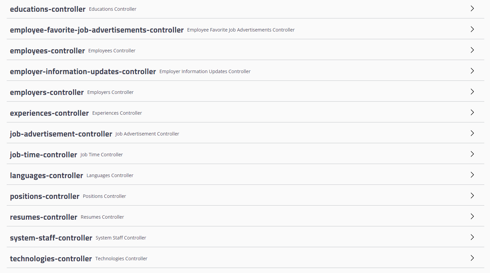
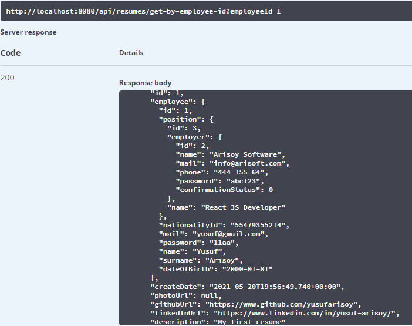

# HRMS-back-end
Engin Demiroğ, Java + React bootcamp HRMS project front-end codes.

[Spring Boot](https://spring.io/projects/spring-boot)

## In App Screenshots

#### Employer registered and informed about confirmations

#### System staff

#### Positions

##### Job Advertisements

##### Resumes and Employees

#### Notification about confirmation mail from server-side
